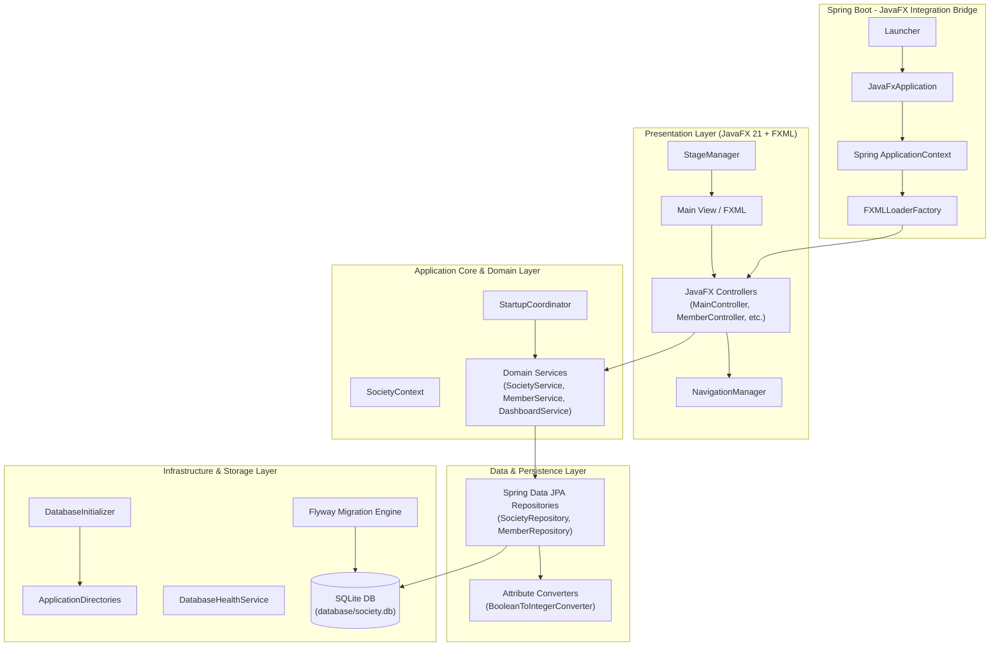
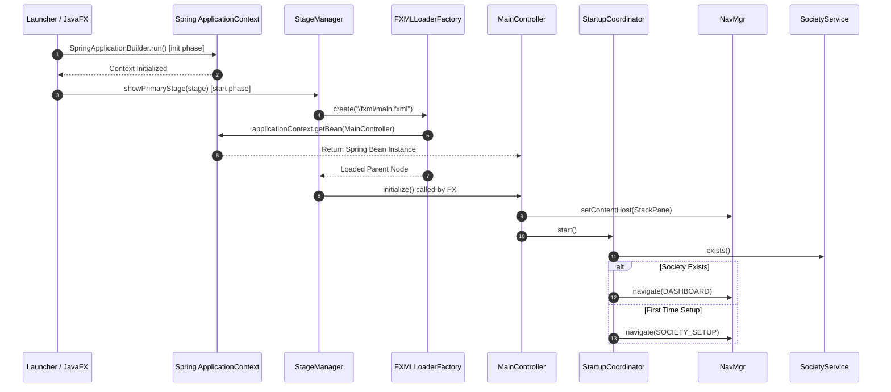
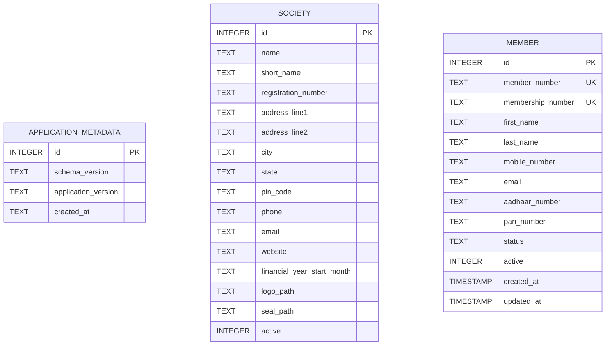

# System Architecture & Technical Specifications

## 1. Executive Summary

The **Society Management System** is an enterprise desktop application designed for Cooperative Housing Societies. Built with **Java 17**, **Spring Boot 3.5.4**, **JavaFX 21**, **Spring Data JPA**, **SQLite**, and **Flyway**, it bridges modern desktop UI standards with enterprise-grade dependency injection, database migration, and modular component design.

The system features a **Hybrid Spring Boot + JavaFX Architecture**, where Spring manages component life cycles, dependency injection, and data persistence, while JavaFX handles rendering, event dispatching, and UI layout management.

---

## 2. Technology Stack & Key Dependencies

| Layer | Component / Library | Version | Purpose |
| :--- | :--- | :--- | :--- |
| **Language & Platform** | OpenJDK | 17 | Core runtime environment |
| **Application Framework** | Spring Boot | 3.5.4 | Dependency Injection, IoC Container, Bean Lifecycle Management |
| **UI Framework** | OpenJFX (JavaFX) | 21.0.7 | Graphical User Interface, FXML views, CSS styling |
| **Persistence / ORM** | Spring Data JPA / Hibernate | 6.x | Entity mapping, Data Repositories, Transaction Management |
| **Dialect Compatibility** | Hibernate Community Dialects | Latest | SQLite dialect integration for Hibernate |
| **Database** | SQLite JDBC | Latest | Embedded file-based relational database engine |
| **Database Migration** | Flyway Core | Latest | Automated database schema versioning & migration |
| **Build & Tooling** | Apache Maven | 3.x | Dependency management and build lifecycle (`javafx-maven-plugin`) |

---

## 3. High-Level Architectural Blueprint

The application follows a **Clean Multi-Tier Layered Architecture** with unidirectional data flow and strict separation of concerns.



---

## 4. Architectural Subsystems & Component Breakdown

### 4.1 Integration & Bootstrap Bridge (`com.society.app`)

The framework integrates JavaFX's application lifecycle with Spring Boot's Dependency Injection (IoC) context.

* **[Launcher.java](file:///Users/pawan/developer/society-management/src/main/java/com/society/Launcher.java)**: The main Java entry point. Delegates startup directly to `JavaFxApplication`.
* **[JavaFxApplication.java](file:///Users/pawan/developer/society-management/src/main/java/com/society/app/JavaFxApplication.java)**:
  * Overrides `init()` to instantiate the Spring `ConfigurableApplicationContext` in non-headless mode.
  * Overrides `start(Stage)` to fetch `StageManager` from Spring container and display the primary UI window.
  * Overrides `stop()` to cleanly close the Spring context and call `Platform.exit()`.
* **[FXMLLoaderFactory.java](file:///Users/pawan/developer/society-management/src/main/java/com/society/app/FXMLLoaderFactory.java)**: Crucial factory class bridging FXML loading with Spring. Sets `loader.setControllerFactory(applicationContext::getBean)`, enabling Spring to inject `@Autowired` / constructor services into JavaFX controllers.
* **[StageManager.java](file:///Users/pawan/developer/society-management/src/main/java/com/society/app/StageManager.java)**: Configures the root `Stage`, minimum window dimensions (1300x800), global stylesheet (`/css/application.css`), and initial layout instantiation.
* **[StartupCoordinator.java](file:///Users/pawan/developer/society-management/src/main/java/com/society/app/StartupCoordinator.java)**: Decides initial navigation. If a active Society record exists in the database, it routes to `DASHBOARD`; otherwise, it forces initial onboard routing to `SOCIETY_SETUP`.



---

### 4.2 Presentation & Navigation System (`com.society.common`)

The user interface uses modular single-page desktop navigation hosted in a dynamic host container (`StackPane`).

* **[View.java](file:///Users/pawan/developer/society-management/src/main/java/com/society/common/navigation/View.java)**: Enum mapping views (`DASHBOARD`, `MEMBERS`, `SHARES`, `CERTIFICATES`, `MEMBER_REGISTRATION`, `REPORTS`, `ADMINISTRATION`, `SOCIETY_SETUP`) to their corresponding FXML resource paths.
* **[NavigationManager.java](file:///Users/pawan/developer/society-management/src/main/java/com/society/common/navigation/NavigationManager.java)**: Manages dynamic view switching. Loads requested view FXML files using `FXMLLoaderFactory` and injects root nodes into `contentHost.getChildren().setAll(content)`.
* **[NavigationState.java](file:///Users/pawan/developer/society-management/src/main/java/com/society/common/navigation/NavigationState.java)**: Holds and updates active view state for navigation highlights and routing logic.
* **[MainController.java](file:///Users/pawan/developer/society-management/src/main/java/com/society/common/controller/MainController.java)**: Controls the primary application shell (header, sidebar navigation buttons, and `contentHost` StackPane). Handles sidebar button click events and visual active state updating.

---

### 4.3 Domain Core Modules

The domain logic is organized by feature modules adhering to standard Service-Repository patterns.

#### A. Society Module (`com.society.society`)
* **[SocietyContext.java](file:///Users/pawan/developer/society-management/src/main/java/com/society/society/context/SocietyContext.java)**: App-wide singleton bean caching active society configuration (`SocietyDto`). Refreshed on initial startup via `@PostConstruct` and on modification.
* **[SocietyService.java](file:///Users/pawan/developer/society-management/src/main/java/com/society/society/service/SocietyService.java)** / **[SocietyServiceImpl.java](file:///Users/pawan/developer/society-management/src/main/java/com/society/society/service/SocietyServiceImpl.java)**: Manages society entity retrieval, setup persistence, and validation.
* **[SocietyEntity.java](file:///Users/pawan/developer/society-management/src/main/java/com/society/society/entity/SocietyEntity.java)**: JPA entity mapping society profile table (`name`, `registration_number`, `financial_year_start_month`, `address`, etc.).

#### B. Member Module (`com.society.member`)
* **[MemberService.java](file:///Users/pawan/developer/society-management/src/main/java/com/society/member/service/MemberService.java)** / **[MemberServiceImpl.java](file:///Users/pawan/developer/society-management/src/main/java/com/society/member/service/MemberServiceImpl.java)**: Business logic for member onboarding, sequential member number generation, validation, search, and deactivation.
* **[MemberMapper.java](file:///Users/pawan/developer/society-management/src/main/java/com/society/member/mapper/MemberMapper.java)**: Component mapping between `MemberEntity` and immutable `MemberDto`.
* **[MemberEntity.java](file:///Users/pawan/developer/society-management/src/main/java/com/society/member/entity/MemberEntity.java)**: Stores member personal records, contact details, identification numbers (Aadhaar, PAN), and status (`ACTIVE`, `INACTIVE`).

#### C. Common Utilities & Services (`com.society.common.service`)
* **[NumberGeneratorService.java](file:///Users/pawan/developer/society-management/src/main/java/com/society/common/service/NumberGeneratorService.java)** / **[NumberGeneratorServiceImpl.java](file:///Users/pawan/developer/society-management/src/main/java/com/society/common/service/NumberGeneratorServiceImpl.java)**: Generates formatted, sequential numbers (e.g., `MEM-00001`) by querying entity count.

---

### 4.4 Persistence & Infrastructure Layer (`com.society.infrastructure`)

* **[ApplicationDirectories.java](file:///Users/pawan/developer/society-management/src/main/java/com/society/infrastructure/filesystem/ApplicationDirectories.java)** / **[DefaultApplicationDirectories.java](file:///Users/pawan/developer/society-management/src/main/java/com/society/infrastructure/filesystem/DefaultApplicationDirectories.java)**: Centralizes application path resolution (`getApplicationHome()`, `database/`, `logs/`, `backup/`, `reports/`).
* **[DatabaseInitializer.java](file:///Users/pawan/developer/society-management/src/main/java/com/society/infrastructure/database/DatabaseInitializer.java)**: Ensures required local directories exist before database connections establish.
* **[BooleanToIntegerConverter.java](file:///Users/pawan/developer/society-management/src/main/java/com/society/infrastructure/persistance/converter/BooleanToIntegerConverter.java)**: JPA `AttributeConverter<Boolean, Integer>` handling SQLite `0`/`1` integer mapping to Java `Boolean`.
* **Database Migrations (`src/main/resources/db/migration`)**:
  * `V1__initial_schema.sql`: Creates `application_metadata` table.
  * `V2__create_society_table.sql`: Creates `society` table.
  * `V3__create_member_table.sql`: Creates `member` table.

---

## 5. Database Schema (Entity Relationship Diagram)



---

## 6. Directory Structure & Workspace Map

```
society-management/
├── architecture.md                        # Architecture & Technical Documentation
├── pom.xml                                # Maven dependencies & plugins configuration
├── database/                              # Local SQLite storage directory
│   └── society.db                         # Production/local SQLite database file
├── logs/                                  # Runtime logs directory
├── backup/                                # Database backup storage
├── reports/                               # Generated reports directory
└── src/
    └── main/
        ├── java/
        │   └── com/
        │       └── society/
        │           ├── Launcher.java                  # Main class launcher
        │           ├── SocietyApplication.java        # Spring Boot application class
        │           ├── app/                           # JavaFX-Spring lifecycle integration
        │           │   ├── ApplicationStartupRunner.java
        │           │   ├── FXMLLoaderFactory.java
        │           │   ├── JavaFxApplication.java
        │           │   ├── StageManager.java
        │           │   └── StartupCoordinator.java
        │           ├── config/                        # Spring configuration classes
        │           │   ├── AppConfig.java
        │           │   └── PersistenceConfig.java
        │           ├── common/                        # Shared UI, navigation, and services
        │           │   ├── controller/
        │           │   │   ├── BaseController.java
        │           │   │   ├── HomeController.java
        │           │   │   └── MainController.java
        │           │   ├── navigation/
        │           │   │   ├── NavigationManager.java
        │           │   │   ├── NavigationState.java
        │           │   │   └── View.java
        │           │   └── service/
        │           │       ├── NumberGeneratorService.java
        │           │       └── NumberGeneratorServiceImpl.java
        │           ├── society/                       # Society management module
        │           │   ├── context/
        │           │   ├── controller/
        │           │   ├── dto/
        │           │   ├── entity/
        │           │   ├── repository/
        │           │   ├── runtime/
        │           │   └── service/
        │           ├── member/                        # Member management module
        │           │   ├── controller/
        │           │   ├── dto/
        │           │   ├── entity/
        │           │   ├── mapper/
        │           │   ├── repository/
        │           │   └── service/
        │           ├── dashboard/                     # Dashboard statistics module
        │           │   ├── controller/
        │           │   ├── dto/
        │           │   └── service/
        │           ├── header/                        # UI Header controller
        │           ├── footer/                        # UI Footer controller
        │           └── infrastructure/                # Filesystem & Persistence utilities
        │               ├── database/
        │               ├── filesystem/
        │               ├── health/
        │               └── persistance/converter/
        └── resources/
            ├── application.yml                    # Spring Datasource & JPA configuration
            ├── css/                               # JavaFX Application stylesheets
            ├── db/migration/                      # Flyway SQL migration scripts
            │   ├── V1__initial_schema.sql
            │   ├── V2__create_society_table.sql
            │   └── V3__create_member_table.sql
            └── fxml/                              # Modular FXML View templates
                ├── main.fxml
                ├── home.fxml
                ├── society/
                ├── member/
                ├── dashboard/
                ├── header/
                └── footer/
```

---

## 7. Future Module Roadmap

The architectural design supports modular expansion. The following modules are structured in navigation and ready for domain logic implementation:

1. **Shares Management Module** (`SHARES`): Track share allotments, register share certificates, transfer history.
2. **Certificates Module** (`CERTIFICATES`): Generate share certificates and occupancy certificates.
3. **Reports Module** (`REPORTS`): Generate financial statements, audit logs, and member ledgers.
4. **Administration Module** (`ADMINISTRATION`): Manage user permissions, system configuration, database backup/restore operations.
